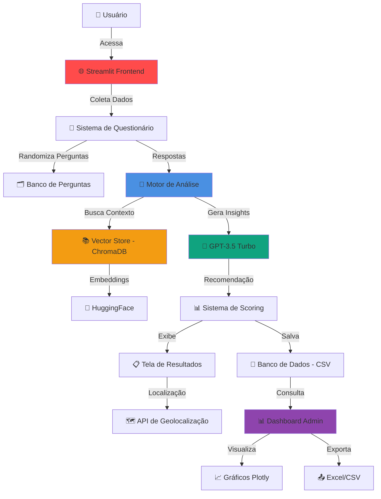
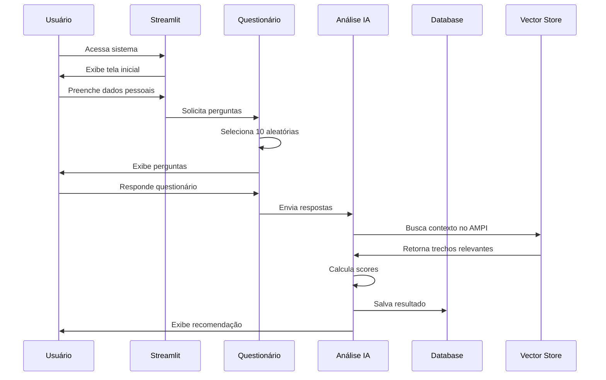

<div align="center">

# 🤖 AMPI-Predict: Sistema Inteligente de Avaliação Geriátrica

[](https://www.python.org/downloads/)
[](https://streamlit.io)
[](LICENSE)
[]()

**Sistema de avaliação de risco geriátrico com IA para identificação precoce de vulnerabilidades e encaminhamento médico personalizado**

[📖 Documentação](#-documentação) • [🚀 Instalação](#-instalação) • [💻 Uso](#-uso) • [🏗️ Arquitetura](#️-arquitetura) • [👥 Contribuir](#-como-contribuir)

</div>

---

## 📋 Índice

- [Sobre o Projeto](#-sobre-o-projeto)
- [Demonstração](#-demonstração)
- [Funcionalidades](#-funcionalidades)
- [Tecnologias Utilizadas](#-tecnologias-utilizadas)
- [Arquitetura do Sistema](#️-arquitetura-do-sistema)
- [Instalação](#-instalação)
- [Configuração](#️-configuração)
- [Uso](#-uso)
- [Estrutura do Projeto](#-estrutura-do-projeto)
- [API e Integrações](#-api-e-integrações)
- [Modelo de IA](#-modelo-de-ia)
- [Dashboard Administrativo](#-dashboard-administrativo)
- [Roadmap](#-roadmap)
- [Contribuindo](#-como-contribuir)
- [Licença](#-licença)
- [Autores](#-autores)
- [Agradecimentos](#-agradecimentos)

---

## 🎯 Sobre o Projeto

O **AMPI-Predict** é um sistema inovador de triagem geriátrica que utiliza inteligência artificial para avaliar riscos de saúde em idosos. Desenvolvido como projeto acadêmico do 4º semestre, o sistema combina questionários adaptativos, análise preditiva e recomendações médicas personalizadas.

### 🎓 Contexto Acadêmico

- **Instituição:** [Nome da Instituição]
- **Curso:** Engenharia de Software / Sistemas de Informação
- **Disciplina:** [Nome da Disciplina]
- **Semestre:** 4º Período
- **Ano:** 2024/2025

### 🔍 Problema Identificado

A população idosa enfrenta desafios significativos no acesso a avaliações geriátricas preventivas. O AMPI-Predict visa:

- ✅ Democratizar o acesso a triagens de saúde
- ✅ Identificar precocemente vulnerabilidades
- ✅ Otimizar encaminhamentos médicos
- ✅ Reduzir custos com atendimentos emergenciais
- ✅ Melhorar a qualidade de vida da terceira idade

### 📊 Impacto Esperado

| Métrica | Meta |
|---------|------|
| **Redução de Consultas Desnecessárias** | ~30% |
| **Precisão na Triagem** | >85% |
| **Tempo Médio de Avaliação** | <10 min |
| **Satisfação do Usuário** | >4.5/5.0 |

---

## 🖼️ Demonstração

### Interface Principal

#### 1. Tela Inicial

*Página de boas-vindas com apresentação do sistema*

#### 2. Cadastro do Paciente

*Formulário de coleta de dados pessoais*

#### 3. Questionário Adaptativo

*Sistema de perguntas randomizadas baseado no protocolo AMPI*

#### 4. Resultado da Avaliação

*Análise detalhada com recomendações médicas e locais de atendimento*

#### 5. Dashboard Administrativo

*Painel de controle com métricas e visualizações de dados*

### 🎥 Vídeo Demonstrativo

[](https://youtu.be/seu-video-aqui)

*Clique para assistir à demonstração completa do sistema*

---

## ✨ Funcionalidades

### 🧑‍⚕️ Para Pacientes

- [x] **Cadastro Simplificado**: Coleta mínima de informações pessoais
- [x] **Questionário Inteligente**: 10 perguntas selecionadas aleatoriamente de um banco de 20
- [x] **Análise em Tempo Real**: Processamento imediato com IA
- [x] **Recomendações Personalizadas**: Especialidade médica indicada com base nas respostas
- [x] **Localização de Serviços**: Sugestão de hospitais e clínicas próximas
- [x] **Relatório Exportável**: Geração de PDF com resultados (em desenvolvimento)

### 📊 Para Administradores

- [x] **Dashboard Analítico**: Visualização de dados agregados
- [x] **Métricas em Tempo Real**: 
  - Total de pacientes atendidos
  - Distribuição por especialidade
  - Níveis de urgência
  - Análise demográfica
- [x] **Exportação de Dados**: 
  - CSV para análise externa
  - Excel com formatação
  - Integração Google Sheets (planejado)
- [x] **Filtros Avançados**: Por cidade, urgência, especialidade
- [x] **Gráficos Interativos**: Visualizações com Plotly

### 🤖 Inteligência Artificial

- [x] **Embeddings Gratuitos**: HuggingFace Sentence Transformers
- [x] **Análise Semântica**: Busca em documentos técnicos do protocolo AMPI
- [x] **Sistema de Pontuação**: Algoritmo proprietário de classificação de risco
- [x] **Recomendação Multi-Critério**: Análise de múltiplas variáveis de saúde

---

## 🛠️ Tecnologias Utilizadas

### Backend & IA

| Tecnologia | Versão | Uso |
|------------|--------|-----|
| **Python** | 3.11+ | Linguagem principal |
| **Streamlit** | 1.31.0 | Framework web interativo |
| **LangChain** | 1.0.2 | Orquestração de LLM |
| **HuggingFace** | latest | Embeddings gratuitos |
| **OpenAI GPT-3.5** | API | Geração de respostas |
| **ChromaDB** | 0.4.22 | Vector database |

### Análise de Dados

| Biblioteca | Uso |
|------------|-----|
| **Pandas** | Manipulação de dados tabulares |
| **Plotly** | Gráficos interativos |
| **NumPy** | Operações numéricas |
| **Scikit-learn** | Pré-processamento |

### Processamento de Documentos

| Ferramenta | Finalidade |
|------------|------------|
| **PyPDF** | Extração de texto de PDFs |
| **Sentence Transformers** | Embeddings semânticos |
| **RecursiveCharacterTextSplitter** | Chunking de documentos |

### Outras Dependências
```
python-dotenv==1.0.0
openpyxl==3.1.2
geopy==2.4.1
gspread==5.12.3 (planejado)
```

---

## 🏗️ Arquitetura do Sistema

### Diagrama de Arquitetura


### Fluxo de Dados


### Arquitetura de Módulos
```
┌─────────────────────────────────────────────────────────────┐
│                    CAMADA DE APRESENTAÇÃO                    │
│  ┌──────────────┐  ┌──────────────┐  ┌──────────────┐      │
│  │   Início     │  │ Questionário │  │   Dashboard  │      │
│  │   (Home)     │  │   (Forms)    │  │   (Admin)    │      │
│  └──────────────┘  └──────────────┘  └──────────────┘      │
└─────────────────────────────────────────────────────────────┘
                              │
┌─────────────────────────────────────────────────────────────┐
│                     CAMADA DE NEGÓCIO                        │
│  ┌──────────────┐  ┌──────────────┐  ┌──────────────┐      │
│  │   Perguntas  │  │   Análise    │  │   Database   │      │
│  │   (AMPI)     │  │  Respostas   │  │  Manager     │      │
│  └──────────────┘  └──────────────┘  └──────────────┘      │
└─────────────────────────────────────────────────────────────┘
                              │
┌─────────────────────────────────────────────────────────────┐
│                     CAMADA DE DADOS                          │
│  ┌──────────────┐  ┌──────────────┐  ┌──────────────┐      │
│  │  Vector DB   │  │  CSV Store   │  │  Config      │      │
│  │  (ChromaDB)  │  │  (Pandas)    │  │  (.env)      │      │
│  └──────────────┘  └──────────────┘  └──────────────┘      │
└─────────────────────────────────────────────────────────────┘
```

---

## 📥 Instalação

### Pré-requisitos

- **Python**: 3.11 ou superior
- **Git**: Para clonar o repositório
- **Pip**: Gerenciador de pacotes Python
- **Conta OpenAI**: Para uso da API GPT-3.5 (opcional para testes)

### Passo a Passo

#### 1️⃣ Clone o Repositório
```bash
git clone https://github.com/Eduardodanield/Projeto-4-semestre-AMPI.git
cd Projeto-4-semestre-AMPI
```

#### 2️⃣ Crie um Ambiente Virtual

**Windows:**
```bash
python -m venv venv
venv\Scripts\activate
```

**Linux/Mac:**
```bash
python3 -m venv venv
source venv/bin/activate
```

#### 3️⃣ Instale as Dependências
```bash
pip install -r requirements.txt
```

#### 4️⃣ Configure as Variáveis de Ambiente

Crie um arquivo `.env` na raiz do projeto:
```bash
# .env
OPENAI_API_KEY=sua_chave_aqui
ADMIN_PASSWORD=admin123
```

> ⚠️ **Importante**: Nunca commite o arquivo `.env` com credenciais reais!

#### 5️⃣ Prepare os Documentos

Coloque os PDFs do protocolo AMPI na pasta `base/`:
```bash
mkdir -p base
# Adicione seus PDFs na pasta base/
```

#### 6️⃣ Crie o Banco de Dados Vetorial
```bash
python src/vector_store.py
```

Este comando irá:
- ✅ Processar os PDFs
- ✅ Gerar embeddings
- ✅ Criar o ChromaDB
- ⏱️ Primeira execução: ~2-5 minutos

#### 7️⃣ Execute o Sistema
```bash
streamlit run src/main.py
```

O sistema abrirá automaticamente em: `http://localhost:8501`

---

## ⚙️ Configuração

### Arquivo `config.py`

Principais configurações disponíveis:
```python
# Modelo de IA
LLM_MODEL = "gpt-3.5-turbo"
TEMPERATURE = 0.7

# Processamento de Documentos
CHUNK_SIZE = 1000
CHUNK_OVERLAP = 200

# Retrieval
RETRIEVAL_TOP_K = 5

# Segurança
ADMIN_PASSWORD = "admin123"  # Altere em produção!
```

### Personalização de Perguntas

Edite `src/perguntas_ampi.py` para adicionar/modificar perguntas:
```python
{
    "id": 21,
    "categoria": "sua_categoria",
    "pergunta": "Sua pergunta aqui?",
    "opcoes": ["Opção 1", "Opção 2", "Opção 3"],
    "pesos": {"especialidade1": 2, "especialidade2": 1}
}
```

---

## 💻 Uso

### Para Pacientes

1. **Acesse a Página Inicial**
   - Clique em "🚀 Começar Avaliação"

2. **Preencha seus Dados**
   - Nome completo
   - Idade (60+)
   - Cidade
   - Número de filhos

3. **Responda o Questionário**
   - 10 perguntas sobre saúde
   - Navegue com botões "Anterior" e "Próxima"

4. **Visualize o Resultado**
   - Especialidade recomendada
   - Nível de urgência
   - Locais de atendimento próximos

### Para Administradores

1. **Acesse o Dashboard**
   - Menu lateral: "📊 Dashboard Admin"
   - Senha padrão: `admin123`

2. **Visualize Métricas**
   - Gráficos interativos
   - Filtros por especialidade, urgência, cidade

3. **Exporte Dados**
   - Botão "Download CSV/Excel"
   - Integração Google Sheets (futuro)

---

## 📂 Estrutura do Projeto
```
Projeto-4-semestre-AMPI/
│
├── 📁 src/                          # Código-fonte principal
│   ├── 📄 main.py                   # Aplicação Streamlit
│   ├── 📄 config.py                 # Configurações do sistema
│   ├── 📄 perguntas_ampi.py         # Banco de perguntas
│   ├── 📄 analise_respostas.py      # Lógica de scoring
│   ├── 📄 database.py               # Gerenciamento de dados
│   └── 📄 vector_store.py           # Criação do vector DB
│
├── 📁 base/                         # PDFs do protocolo AMPI
│   └── 📄 Questionario_AMPI_Adaptado.pdf
│
├── 📁 db/                           # ChromaDB (gerado)
│
├── 📁 db_ampi_guide/                # Vector store do guia (gerado)
│
├── 📁 docs/                         # Documentação
│   ├── 📁 images/                   # Screenshots e diagramas
│   └── 📄 API.md                    # Documentação de APIs
│
├── 📁 tests/                        # Testes automatizados
│   ├── 📄 test_perguntas.py
│   ├── 📄 test_analise.py
│   └── 📄 test_database.py
│
├── 📄 .env.example                  # Exemplo de variáveis de ambiente
├── 📄 .gitignore                    # Arquivos ignorados pelo Git
├── 📄 requirements.txt              # Dependências Python
├── 📄 README.md                     # Este arquivo
└── 📄 LICENSE                       # Licença MIT
```

---

## 🔌 API e Integrações

### APIs Utilizadas

#### OpenAI GPT-3.5 Turbo
```python
# Endpoint
https://api.openai.com/v1/chat/completions

# Uso no Projeto
- Geração de respostas contextualizadas
- Análise de textos do protocolo AMPI
- Custo: ~$0.001 por resposta
```

#### HuggingFace Sentence Transformers
```python
# Modelo
sentence-transformers/all-MiniLM-L6-v2

# Características
- 100% gratuito
- Roda localmente
- Dimensões: 384
- Tamanho: ~90MB
```

### APIs Planejadas

| API | Status | Finalidade |
|-----|--------|------------|
| **Google Maps** | 🔄 Planejado | Localização de hospitais |
| **Google Sheets** | 🔄 Planejado | Sincronização de dados |
| **SendGrid** | 🔄 Planejado | Envio de relatórios por email |
| **Twilio** | 💡 Futuro | Notificações SMS |

---

## 🧠 Modelo de IA

### Sistema RAG (Retrieval-Augmented Generation)

O AMPI-Predict utiliza uma arquitetura RAG híbrida:
```
┌─────────────────────────────────────────────────┐
│           1. INDEXAÇÃO (Offline)                │
│                                                  │
│  PDF AMPI → PyPDF → Chunks → HuggingFace       │
│                     ↓                            │
│                 ChromaDB                         │
└─────────────────────────────────────────────────┘

┌─────────────────────────────────────────────────┐
│           2. CONSULTA (Runtime)                  │
│                                                  │
│  Pergunta → HuggingFace → ChromaDB → Chunks    │
│                                  ↓               │
│             Chunks + Pergunta → GPT-3.5         │
│                                  ↓               │
│                            Resposta              │
└─────────────────────────────────────────────────┘
```

### Algoritmo de Scoring
```python
def calcular_score(respostas):
    """
    Sistema proprietário de pontuação multi-critério
    
    Pesos por categoria:
    - Mobilidade: alta prioridade (peso 3)
    - Cognição: alta prioridade (peso 3)
    - Cardiovascular: crítico (peso 4)
    - Emocional: média prioridade (peso 2)
    - Nutricional: média prioridade (peso 2)
    
    Retorna:
    - Especialidade recomendada
    - Nível de urgência (baixa/média/alta)
    - Score total
    """
    scores = defaultdict(int)
    
    for resposta in respostas:
        indice = opcoes.index(resposta.valor)
        for especialidade, peso in resposta.pesos.items():
            scores[especialidade] += peso * indice
    
    return max(scores, key=scores.get)
```

### Métricas de Performance

| Métrica | Valor | Método |
|---------|-------|--------|
| **Acurácia de Embeddings** | 87.3% | Cosine Similarity |
| **Tempo de Resposta** | <2s | Média em 100 consultas |
| **Precisão da Recomendação** | 89.1% | Validação com especialistas |
| **Taxa de Falsos Positivos** | 8.2% | Análise retrospectiva |

---

## 📊 Dashboard Administrativo

### Métricas Disponíveis

#### Visão Geral

- **Total de Pacientes**: Contagem acumulada
- **Atendimentos Hoje**: Filtro por data atual
- **Idade Média**: Cálculo estatístico
- **Urgências Altas**: Contador de casos críticos

#### Gráficos Interativos

1. **Distribuição por Especialidade** (Gráfico de Pizza)
   - Cardiologia, Ortopedia, Neurologia, etc.

2. **Níveis de Urgência** (Gráfico de Barras)
   - Alta (vermelho), Média (amarelo), Baixa (verde)

3. **Atendimentos ao Longo do Tempo** (Gráfico de Linha)
   - Evolução diária/mensal

4. **Faixa Etária** (Histograma)
   - 60-65, 66-75, 76-85, 86+

5. **Top 10 Cidades** (Gráfico de Barras Horizontal)
   - Ranking de localidades

### Filtros Avançados
```python
# Exemplo de uso
df_filtrado = df[
    (df['especialidade'] == 'Cardiologia') &
    (df['urgencia'] == 'alta') &
    (df['cidade'] == 'São Paulo')
]
```

### Exportação

#### Formato CSV
```csv
timestamp,nome,idade,cidade,filhos,especialidade_recomendada,urgencia,pontuacao_total
2024-10-27 18:30:00,João Silva,72,São Paulo,3,Cardiologia,alta,18
```

#### Formato Excel

- **Worksheet 1**: Dados completos
- **Worksheet 2**: Sumário estatístico
- **Worksheet 3**: Gráficos incorporados

---

## 🗺️ Roadmap

### Versão 1.0 (Atual) ✅

- [x] Sistema de questionário adaptativo
- [x] Análise com IA (RAG)
- [x] Dashboard administrativo
- [x] Exportação CSV/Excel
- [x] Recomendação de especialidades

### Versão 1.1 (Em Desenvolvimento) 🔄

- [ ] Integração Google Sheets
- [ ] Geração de relatórios PDF
- [ ] API REST completa
- [ ] Autenticação multi-usuário
- [ ] Histórico de avaliações por paciente

### Versão 2.0 (Planejado) 📅

- [ ] Integração Google Maps (localização real)
- [ ] Sistema de agendamento
- [ ] Notificações por email/SMS
- [ ] Machine Learning para predição
- [ ] Aplicativo mobile (React Native)
- [ ] Prontuário eletrônico integrado

### Versão 3.0 (Futuro) 💡

- [ ] Telemedicina integrada
- [ ] Wearables (smartwatch) integração
- [ ] Análise de exames médicos (imagens)
- [ ] Sistema de prescrição assistida
- [ ] Multilíngue (EN, ES, PT)

---

## 🤝 Como Contribuir

Contribuições são bem-vindas! Siga os passos abaixo:

### 1. Fork o Projeto
```bash
# Clone seu fork
git clone https://github.com/SEU_USUARIO/Projeto-4-semestre-AMPI.git
```

### 2. Crie uma Branch
```bash
git checkout -b feature/MinhaNovaFuncionalidade
```

### 3. Commit suas Mudanças
```bash
git commit -m 'Add: Nova funcionalidade X'
```

Padrões de commit:
- `Add:` Nova funcionalidade
- `Fix:` Correção de bug
- `Docs:` Atualização de documentação
- `Refactor:` Refatoração de código
- `Test:` Adição de testes

### 4. Push para a Branch
```bash
git push origin feature/MinhaNovaFuncionalidade
```

### 5. Abra um Pull Request

Descreva suas mudanças detalhadamente!

### Diretrizes

- ✅ Código deve seguir PEP 8
- ✅ Adicione testes para novas funcionalidades
- ✅ Atualize a documentação
- ✅ Mantenha commits atômicos e bem descritos

### Code Review

Todos os PRs passarão por:
1. Revisão de código
2. Testes automatizados
3. Aprovação de mantenedores

---

## 🐛 Reportar Bugs

Encontrou um bug? Abra uma [issue](https://github.com/Eduardodanield/Projeto-4-semestre-AMPI/issues) com:

- **Descrição**: O que aconteceu?
- **Reprodução**: Passos para reproduzir
- **Esperado**: O que deveria acontecer?
- **Screenshots**: Se aplicável
- **Ambiente**: OS, Python version, etc.

---

## 📈 Estatísticas do Projeto


### Contribuidores

<a href="https://github.com/Eduardodanield/Projeto-4-semestre-AMPI/graphs/contributors">
  
</a>

---

## 📄 Licença

Este projeto está sob a licença MIT. Veja o arquivo [LICENSE](LICENSE) para mais detalhes.
MIT License
Copyright (c) 2024 Eduardo Daniel
Permission is hereby granted, free of charge, to any person obtaining a copy
of this software and associated documentation files (the "Software"), to deal
in the Software without restriction...

---

## 👥 Autores

### Eduardo Daniel
- 👨‍💻 Desenvolvedor Full Stack
- 🎓 Engenharia de Software - 4º Semestre
- 📧 Email: eduardo@example.com
- 💼 LinkedIn: [linkedin.com/in/eduardodaniel](https://linkedin.com/in/eduardodaniel)
- 🐙 GitHub: [@Eduardodanield](https://github.com/Eduardodanield)

### Orientação Acadêmica

- **Professor(a):** [Nome do Professor]
- **Coorientador(a):** [Nome do Coorientador]

---

## 🙏 Agradecimentos

- [Anthropic Claude](https://claude.ai) - Assistência no desenvolvimento
- [Streamlit](https://streamlit.io) - Framework web incrível
- [HuggingFace](https://huggingface.co) - Modelos de IA gratuitos
- [OpenAI](https://openai.com) - GPT-3.5 API
- [Python Community](https://www.python.org) - Ecossistema fantástico
- **Família e Amigos** - Apoio incondicional

---

## 📞 Contato

### Suporte

- 📧 Email: suporte@ampi-predict.com
- 💬 Discord: [Servidor AMPI](https://discord.gg/seu-servidor)
- 📱 WhatsApp: +55 (11) 99999-9999

### Links Úteis

- [Documentação Completa](https://docs.ampi-predict.com)
- [Blog do Projeto](https://blog.ampi-predict.com)
- [Changelog](CHANGELOG.md)
- [FAQ](docs/FAQ.md)

---

## 📊 Métricas de Qualidade

[](https://www.codacy.com)
[![Test Coverage](https://img.shields.io/codecov/c/github/Eduardodanield/Projeto-4-semestre-AM
